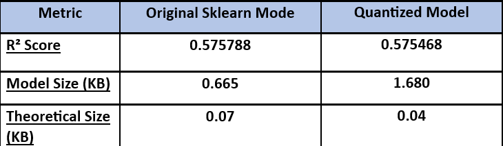

# Assignment_3_MLOps

Results:

•	Accuracy preserved: R² and RMSE are nearly identical before and after quantization
•	Weights compressed: Actual coefficients (weights/bias) are compressed by 1.89x.
•	Quantized PyTorch inference output: -36.9005 (numerical prediction) 
